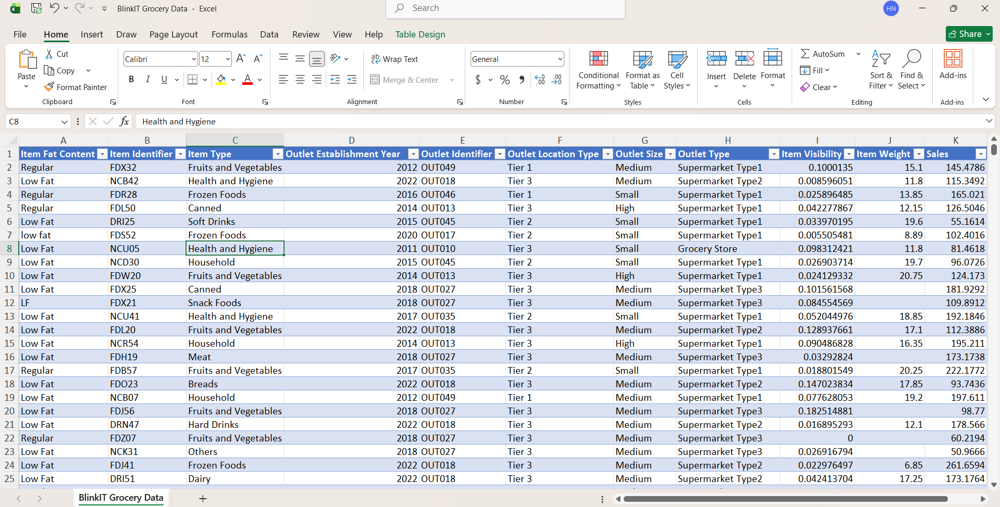

# Blinkit Grocery Sales Dashboard | Power BI

## Project Overview

This Power BI dashboard analyzes Blinkit's grocery sales data to provide insights into product performance, outlet efficiency, customer preferences, and sales trends. The dashboard enables users to explore sales metrics across different outlet types, locations, sizes, and product categories through interactive visualizations and filters.

The goal of this project is to transform raw grocery sales data into meaningful business insights that can support data-driven decision-making.

---

## Dashboard Preview


---

## Business Objectives

* Monitor overall sales performance.
* Analyze sales across different outlet locations and sizes.
* Identify top-performing product categories.
* Compare sales between outlet types.
* Understand the impact of item fat content on sales.
* Track outlet establishment trends over time.

---

## Dataset Information

The dataset contains grocery sales records with attributes such as:

* Item Fat Content
* Item Identifier
* Item Type
* Outlet Establishment Year
* Outlet Identifier
* Outlet Location Type
* Outlet Size
* Outlet Type
* Item Visibility
* Item Weight
* Sales
## Dataset Preview



## Data Preparation

Data preprocessing and transformation were performed using **Power Query**, including:

* Data cleaning and formatting
* Handling inconsistent categorical values
* Preparing fields for analysis
* Creating a structured dataset for reporting

---

## Key Performance Indicators (KPIs)

The dashboard provides the following key metrics:

| KPI             | Value  |
| --------------- | ------ |
| Total Sales     | $1.20M |
| Average Sales   | $141   |
| Number of Items | 8,523  |
| Average Rating  | 3.9    |

---

## Dashboard Features

### Sales Analysis

* Total sales overview
* Average sales tracking
* Product-wise sales comparison

### Outlet Analysis

* Sales by outlet size
* Sales by outlet location tier
* Sales by outlet type
* Outlet establishment trends over time

### Product Analysis

* Item type performance
* Fat content distribution
* Sales contribution by category

### Interactive Filtering

Users can dynamically filter reports using:

* Outlet Location Type
* Outlet Size
* Item Type

---

## DAX Measures Used

Some of the key measures created for analysis include:

```DAX
Total Sales
Average Sales
No of Items
Avg Rating
```

A dedicated Metrics table was also implemented to support dynamic KPI selection and reporting.

---

## Key Insights

* Tier 3 outlets generated the highest sales among all outlet locations.
* Medium-sized outlets contributed the largest share of revenue.
* Fruits & Vegetables and Snack Foods were among the top-performing product categories.
* Supermarket Type 1 generated the highest overall sales.
* Sales peaked significantly for outlets established around 2018.

---

## Tools & Technologies

* Power BI Desktop
* Power Query
* DAX (Data Analysis Expressions)
* Microsoft Excel

---

## Repository Structure

```text
Blinkit-Sales-Dashboard/
│
├── Blinkit.pbix
├── Blinkit Grocery Data.xlsx
├── images/
│   └── dashboard.png
└── README.md
```

---

## Skills Demonstrated

* Data Cleaning
* Data Transformation
* Data Visualization
* Business Intelligence
* Dashboard Design
* DAX Calculations
* KPI Development
* Interactive Reporting
* Retail Sales Analytics

---

## Author

**Hamid Nawaz**

Computer Science Student | Data Analytics Enthusiast | Power BI Developer
